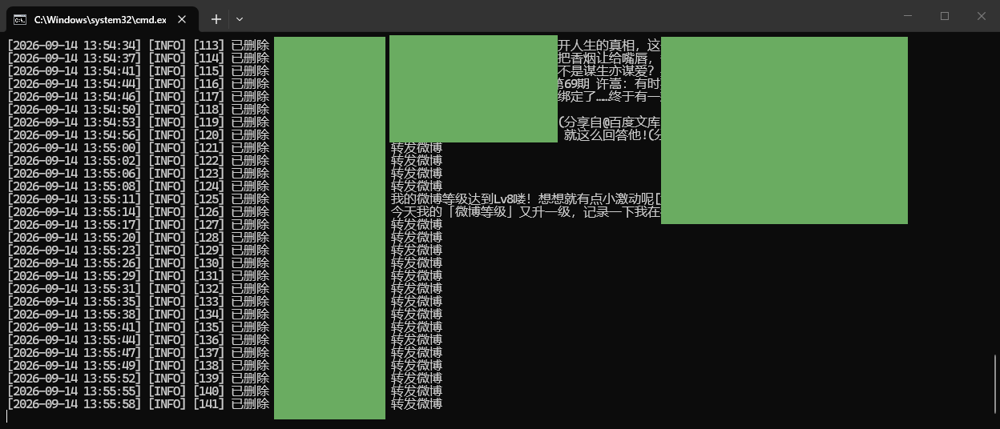
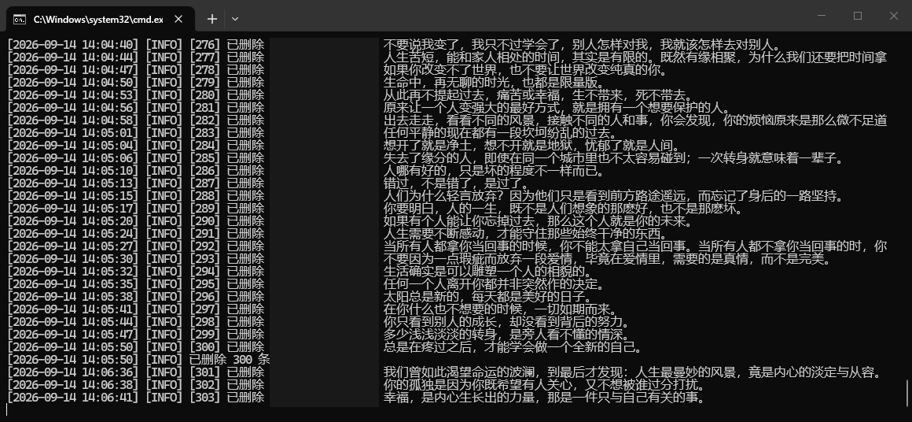

# 微博批量删除工具

帮你在电脑上自动删除自己微博账号里的微博。不用懂代码，双击一下就能用。

> **重要：删掉的微博找不回来。** 建议先用 [1] 看看有多少条，再用 [4] 试删 3 条确认能用，最后才正式删。

## 它能做什么

- 批量删原创微博，平均 2~3 秒一条
- 按日期范围删（比如只删 2013-2016 那几年）
- 快转的微博也能删（会自动用原微博 id 取消快转）
- 中断了能接着删，不用从头来
- 被限速自动退避重试
- 删除间隔可调，怕被限速就调大点
- 本地运行，账号密码不上传任何服务器

---

## 一、先把工具下载到电脑

### 方式 A：手动下载（推荐，最简单）


1. 打开 https://github.com/yezijinn/weibo-delete
2. 点绿色的 **Code** 按钮
3. 在下拉菜单里点 **Download ZIP**
4. 下载完会得到一个 `weibo-delete-main.zip`，右键解压
5. 解压出来的 `weibo-delete-main` 文件夹就是工具，随便放哪都行（比如桌面）

> 解压！不要直接双击 ZIP 里面的文件，那样用不了。一定要先解压成普通文件夹。

### 方式 B：自动拉取（电脑上装了 git 的话）

打开命令行（Win + R 输入 `cmd` 回车），执行：

```bash
git clone https://github.com/yezijinn/weibo-delete.git
```

会多出一个 `weibo-delete` 文件夹，就是工具。

> 没装 git 就别用这个方式，走方式 A 就行。git 自己也要单独装，没必要为这个折腾。

---

## 二、装一次运行环境（只做一次）

### 1. 装 Python

如果电脑里没装过 Python：

1. 打开 https://www.python.org/downloads/
2. 点黄色的 **Download Python** 按钮下载
3. 双击下载的安装包
4. **一定要勾上最下面那个 "Add Python to PATH"**，然后点 Install Now
5. 等它装完

### 2. 运行安装脚本

打开刚才解压出来的 `weibo-delete` 文件夹，**双击 `install.bat`**。

会出现一个黑窗口，自动装东西，大概 1~3 分钟，要下载 150MB 左右。**中途别关窗口。**

看到 "Install done" 就是装好了。

> 如果窗口一闪就没了，或者提示 Python not found，说明第 1 步的 Python 没装好，或者没勾 "Add Python to PATH"。重装一次 Python，注意勾选。

---

## 三、开始删除

**双击 `run.bat`**，会出现这样的菜单：


```
==============================================
           微博批量删除工具
==============================================

   [1] 先看看有多少条（不删，推荐先跑这个）
   [2] 全部删除
   [3] 按日期删除
   [4] 先删 3 条试试（验证能不能用）
   [5] 手动输入命令
   [6] 退出登录（换一个账号用）
   [7] 设置删除间隔（当前每条 2.0 秒）
   [0] 退出
```

输入数字，回车。

### 每个选项是干嘛的

| 选项 | 说明 |
| --- | --- |
| [1] | 只统计有多少条，不动任何数据。**强烈建议先跑这个。** |
| [2] | 删除全部微博，会要求你输入 yes 二次确认。 |
| [3] | 按日期删。会问你开始和结束日期。 |
| [4] | 只删 3 条，用来验证工具能不能正常用。 |
| [5] | 手动输入命令行参数，给懂技术的人用。 |
| [6] | 清掉本机保存的登录状态，用来换账号。 |
| [7] | 调整每条之间的等待秒数，怕被限速就调大。 |

### 第一次用

第一次运行会**自动弹出一个浏览器窗口**，那是微博的登录页。

用手机微博 App 扫码登录，登录完脚本会自己开始干活，不用管它。

登录状态会记住，以后不用再登。

### 建议的顺序

1. 先选 **[1]**，看看账号里有多少条微博
2. 再选 **[4]**，删 3 条试试水，确认能用
3. 最后按需要选 **[2]**（全删）或 **[3]**（按日期删）

### 按日期删怎么填

选 **[3]** 后，会问你开始和结束日期：

- 两个都填 `2020-01-01` `2020-12-31` = 删 2020 全年
- 只填开始 = 删这天之后的（一直到今天）
- 只填结束 = 删这天之前的

日期格式必须写成 `2020-01-01` 这样。首尾两天都包含在内。

### 设置删除间隔

选 **[7]** 可以调整每条微博之间的等待秒数。

- 默认 2 秒一条，一万条大约 6 小时
- 范围 0.5 ~ 60 秒，太小容易被限速
- 设置会保存到 `data/settings.json`，下次运行自动生效

不确定就保持默认。嫌慢可以调小，但被限速的几率会变高。

### 换账号

选 **[6]**，输入 yes 确认，会清掉本机保存的登录状态。

下次运行重新弹扫码，登另一个号就行。

> 换账号不用清 `data/`。微博 id 全局唯一，两个账号的删除记录不会互相干扰。

### 删的时候大概长这样






---

## 四、删除要多久

默认设置下，大约 **2~3 秒删一条**。

- 1000 条 ≈ 40 分钟
- 5000 条 ≈ 3 小时
- 10000 条 ≈ 6 小时

删的时候可以干别的，但**别关那个黑窗口，也别关浏览器窗口**。

想停下就按键盘 **Ctrl + C**（按住 Ctrl 再按 C）。别点窗口右上角的 X，那样进度会记不全。

停了也没关系，**下次跑会自动从没删完的地方接着删**。

---

## 五、常见问题

**Q：下载下来是个 ZIP，怎么办？**
右键 ZIP 文件，选「解压到当前文件夹」，会出来一个普通文件夹。进去找 `install.bat`。

**Q：提示 Python not found？**
Python 没装好。重新装一次，安装时一定要勾 "Add Python to PATH"。

**Q：提示未登录 / 要重新扫码？**
正常。第一次都要扫码。如果之前登过又提示，选菜单里的 [6] 退出登录，再跑一次。

**Q：一直显示「跳过」？**
分两种。一种是「根据作者设置的可见时间范围，此微博已不可见」——这类删不掉，永久跳过。另一种是被删过的。都不用管。

**Q：快转的微博能删吗？**
能。脚本会自动识别快转，用原微博的 id 去取消快转。日志里显示「删了 xxx 转发微博」就说明成功了。

**Q：删着删着停了？**
可能是微博限速了，脚本会自动歇一会儿再继续。如果彻底停了，过几小时再跑一次就行，会自动接着删。

**Q：转发的微博、评论、点赞能删吗？**
快转能删。但评论、点赞、关注这些不行——微博网页版本身也不提供这些的批量清理入口。

**Q：删错了能恢复吗？**
**不能。** 微博删了就没了。所以一定要先用 [1] 和 [4] 确认。

**Q：删得特别慢，一直在「往前挪」？**
说明你的列表里有很多删不掉的（已删的 + 不可见的）。这是正常的，脚本在跳过它们。想快点可以按日期分批删。

---

## 六、给懂技术的人

命令行直接跑：

```bash
python weibo_delete.py --help                    # 全部参数
python weibo_delete.py --dry-run                 # 只统计
python weibo_delete.py --max 100                 # 最多删 100 条
python weibo_delete.py --delay 3                 # 每条等 3 秒
python weibo_delete.py --start 2020-01-01 --end 2020-12-31
```

### 原理

Playwright 起一个真浏览器，用你的登录态调微博自己的接口：

- `ajax/statuses/mymblog` 拉列表
- `ajax/statuses/destroy` 删除

**翻页**用的是 `since_id` 游标而不是 `page` 参数。不加日期筛选时，删一批就 reset 游标回第一页重拉；加了日期筛选则改成沿游标单向往老扫，扫到比 `--start` 更老就停——否则每删一条都要从最新扫到目标日期，几万条得跑好几天。

**快转**和普通删除用同一个接口 `ajax/statuses/destroy`，但快转的请求体要用 `ori_mid`（原微博 id），不是列表里那条记录的 `id`。传错了会返回 400。

**进度**存在 `data/` 里，每删一条立刻落盘，所以强杀也不会丢数据。

### 文件说明

```
data/deleted.jsonl     删成功的 id
data/skipped.jsonl     跳过没删的 id
data/settings.json     间隔设置
data/run.log           运行日志
.browser-profile/      浏览器数据，含登录 cookie，别外传
```

### 主要参数

| 参数 | 默认 | 说明 |
| --- | --- | --- |
| `--dry-run` | 关 | 只统计不删 |
| `--max` | 0 | 这次最多删几条，0 = 不限 |
| `--start` | 空 | 起始日期（含），YYYY-MM-DD |
| `--end` | 空 | 结束日期（含），YYYY-MM-DD |
| `--delay` | 2.0 | 每条等几秒，不填用设置里的 |
| `--jitter` | 1.5 | 在 delay 之上再加 0~jitter 秒随机 |
| `--batch-size` | 50 | 删多少条长休一次 |
| `--batch-pause` | 45 | 长休几秒 |
| `--scan-limit` | 20 | 连续多少页没得删就收工 |
| `--mode` | api | `api` 调接口，`ui` 点按钮 |
| `--channel` | 空 | 用系统浏览器：`chrome` / `msedge` |
| `--reset-skip` | 关 | 清掉跳过记录重新试 |

### 已知限制

- `--mode ui` 基本没用：微博 PC 网页版早就把删除入口移掉了。
- 接口是非公开的，微博改版就可能失效。出错看 `data/run.log`。
- 评论、点赞、关注不在范围内，微博网页版本就没提供批量清理入口。

## License

MIT
