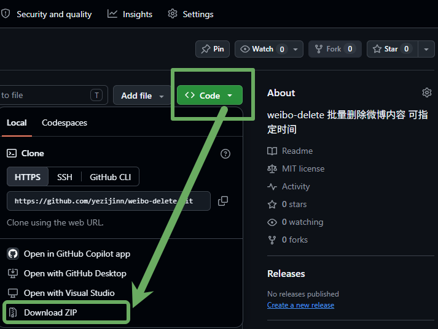
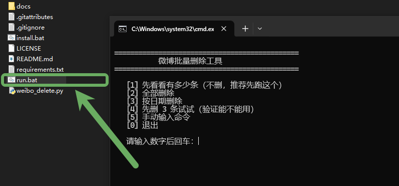
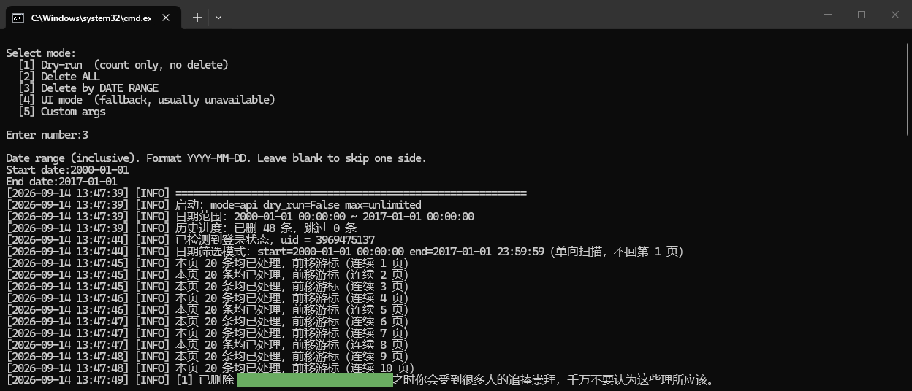
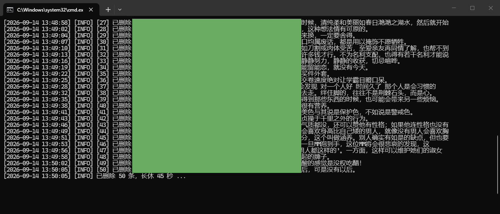

# 微博批量删除工具

帮你在电脑上自动删除自己微博账号里的微博。

**两种版本，任选一种：**

- **方式一：直接下载 exe（推荐）** —— 不用装任何东西，解压双击就能用
- **方式二：Python 版** —— 需要装 Python，适合想改代码的人

> **重要：删掉的微博找不回来。** 建议先用「看看有多少条」，再用「删最新 1 条试试」确认能用，最后才正式删。

## 它能做什么

- 批量删微博，平均 2~3 秒一条
- 按日期范围删（比如只删 2013-2016 那几年）
- 快转的微博也能删（自动识别，用原微博 id 取消快转）
- 中断了能接着删，不用从头来
- 网络抖动、服务端报错会自动重试，不会因此漏删
- 被限速自动退避重试
- 删除间隔可调，怕被限速就调大点
- 本地运行，账号密码不上传任何服务器

---

# 方式一：直接下载 exe（推荐，完全内置）

## 1. 下载

**国内推荐 Gitee**（下载快）：

https://gitee.com/yezijinn/weibo-delete/releases

下载下面**三个文件**，放在同一个文件夹：

- `weibo-delete-win32-v3.0.0-full.zip.part1`（85 MB）
- `weibo-delete-win32-v3.0.0-full.zip.part2`（85 MB）
- `合并解压.bat`

然后**双击 `合并解压.bat`**，它会自动合并两个分卷、解压出「微博批量删除工具」文件夹，并删掉临时的分卷和 zip。

> 为什么要分卷：Gitee 单个附件限制 100 MB，完整包 170 MB，所以拆成两份。

**国外或 Gitee 慢，用 GitHub**：

https://github.com/yezijinn/weibo-delete/releases

下载 **weibo-delete-win32-v3.0.0-full.zip**（约 185 MB），解压出「微博批量删除工具」文件夹。

> 解压！不要直接双击 ZIP 里面的 exe，那样用不了。必须把整个文件夹解压出来。

## 2. 打开

双击 `WeiboDelete.exe`。

程序窗口打开（占桌面 80%，居中），**左右分栏**：

- **左列**：按钮、日期框、日志、状态栏
- **右列**：微博页面（浏览器已嵌进程序内部，不是独立窗口）

第一次运行右列会显示微博登录页，用手机微博 App **扫码登录**。

登录后点左列的按钮操作。

> 右列用的浏览器是本程序**自带的**，和系统里装的 Edge、Chrome 无关，也不需要系统有浏览器。

## 3. 界面

```
┌──────────────────┬──────────────────┐
│ [看看有多少条][全部删除]│                  │
│ [按日期删除][删最新1条]│                  │
│ [重试跳过的][退出登录] │   微博页面        │
│ [设置间隔][停止]      │  （嵌在程序里）    │
│ 日期：[____]到[____] │                  │
├──────────────────┤                  │
│  提示：请扫码登录    │                  │
├──────────────────┤                  │
│  日志滚动区         │                  │
│                    │                  │
├──────────────────┤                  │
│ 已删 0 条  跳过 0 条 │                  │
└──────────────────┴──────────────────┘
      左 50%              右 50%
```

## 4. 按钮说明

| 按钮 | 说明 |
|---|---|
| 看看有多少条 | 只统计，不删任何东西。**强烈建议先点这个** |
| 全部删除 | 删掉所有未删除的微博。删完会**自动清缓存并复核一次** |
| 按日期删除 | 按日期范围删。先在日期框填范围（2020-01-01 格式），再点这个按钮 |
| 删最新 1 条试试 | 只删你最新发的 1 条，用来验证工具能用 |
| 重试跳过的 | 清空跳过记录，让之前删不掉的重新试一次 |
| 退出登录 | 清掉登录状态，用来换账号 |
| 设置间隔 | 调整每条之间的等待秒数（默认 2 秒） |
| 停止 | 中途停下，进度已保存 |

### 按日期删怎么填

日期框在按钮下方，格式 `2020-01-01`：

- 两个都填 `2013-01-01` 到 `2016-12-31` = 删这几年
- 只填开始 = 删这天之后的
- 只填结束 = 删这天之前的
- 留空 + 点「全部删除」= 删所有

首尾两天都包含。

## 5. 需要什么环境

**什么都不用装。**

Windows 10 / 11，解压就能用。浏览器已内置在文件夹里，不需要系统装 Edge 或 Chrome。

## 6. 运行中生成的文件

```
data\              删除进度、日志、设置
browser-profile\   登录状态（含 cookie，别外传）
```

删到一半关了程序也没事，下次打开会从没删完的地方接着删。

整个文件夹可以整个复制到别的电脑，进度和登录状态都跟着走。

## 7. 文件夹构成

```
WeiboDelete.exe      主程序（约 75 KB）
browser\            内置浏览器（363 MB，别删）
使用说明.txt
```

---

# 方式二：Python 版

适合想改代码、或系统比较特殊的情况。需要电脑上有 Python。

## 1. 下载



1. 打开 https://github.com/yezijinn/weibo-delete
2. 点绿色的 **Code** 按钮
3. 在下拉菜单里点 **Download ZIP**
4. 下载完会得到一个 `weibo-delete-main.zip`，右键解压
5. 解压出来的 `weibo-delete-main` 文件夹就是工具

> 解压！不要直接双击 ZIP 里面的文件，那样用不了。一定要先解压成普通文件夹。

## 2. 装 Python

如果电脑里没装过 Python：

1. 打开 https://www.python.org/downloads/
2. 点黄色的 **Download Python** 按钮下载
3. 双击下载的安装包
4. **一定要勾上最下面那个 "Add Python to PATH"**，然后点 Install Now
5. 等它装完

## 3. 运行安装脚本

打开解压出来的文件夹，**双击 `install.bat`**。

会出现一个黑窗口，自动装东西，大概 1~3 分钟，要下载 150MB 左右。**中途别关窗口。**

看到 "Install done" 就是装好了。

> 如果窗口一闪就没了，或者提示 Python not found，说明第 2 步的 Python 没装好，或者没勾 "Add Python to PATH"。重装一次 Python，注意勾选。

## 4. 开始删除

**双击 `run.bat`**，会出现这样的菜单：



```
==============================================
           微博批量删除工具
==============================================

   [1] 先看看有多少条（不删，推荐先跑这个）
   [2] 全部删除
   [3] 按日期删除
   [4] 先删 3 条试试（验证能不能用）
   [5] 手动输入命令
   [6] 退出登录（换一个账号用）
   [7] 设置删除间隔（当前每条 2.0 秒）
   [8] 重试之前跳过的微博
   [0] 退出
```

输入数字，回车。

### 每个选项是干嘛的

| 选项 | 说明 |
| --- | --- |
| [1] | 只统计有多少条，不动任何数据。**强烈建议先跑这个。** |
| [2] | 删除全部微博，会要求你输入 yes 二次确认。 |
| [3] | 按日期删。会问你开始和结束日期。 |
| [4] | 只删 3 条，用来验证工具能不能正常用。 |
| [5] | 手动输入命令行参数，给懂技术的人用。 |
| [6] | 清掉本机保存的登录状态，用来换账号。 |
| [7] | 调整每条之间的等待秒数，怕被限速就调大。 |
| [8] | 清空「跳过」记录，让之前删不掉的重新试一次。 |

### 按日期删怎么填

选 **[3]** 后，会问你开始和结束日期：

- 两个都填 `2020-01-01` `2020-12-31` = 删 2020 全年
- 只填开始 = 删这天之后的（一直到今天）
- 只填结束 = 删这天之前的

日期格式必须写成 `2020-01-01` 这样。首尾两天都包含在内。

### 设置删除间隔

选 **[7]** 可以调整每条微博之间的等待秒数。

- 默认 2 秒一条，一万条大约 6 小时
- 范围 0.5 ~ 60 秒，太小容易被限速
- 设置会保存到 `data/settings.json`，下次运行自动生效

### 删的时候大概长这样





---

# 删除要多久

默认设置下，大约 **2~3 秒删一条**。

- 1000 条 ≈ 40 分钟
- 5000 条 ≈ 3 小时
- 10000 条 ≈ 6 小时

删的时候可以干别的，但**别关程序窗口**。

想停下就点「停止」（exe 版）或按 **Ctrl + C**（Python 版）。

停了也没关系，**下次跑会自动从没删完的地方接着删**。

---

# 常见问题

**Q：exe 双击没反应 / 被杀毒软件删了？**
可能被杀软误报。看下杀软的隔离区，把程序加信任，或整个文件夹加入白名单。

**Q：提示 Python not found？（Python 版）**
Python 没装好。重新装一次，安装时一定要勾 "Add Python to PATH"。

**Q：提示未登录 / 要重新扫码？**
正常。第一次都要扫码。如果之前登过又提示，点「退出登录」或菜单 [6]，再跑一次。

**Q：日志显示「跳过」，是什么意思？**
这条微博没能删掉，脚本把它记下来，以后不再重复尝试。分两种情况：

- 「根据作者设置的可见时间范围，此微博已不可见」——原博被作者设限或删除了，你的转发也打不开，**这类删不掉**
- 其他报错——可能是临时的，点「重试跳过的」或菜单 [8] 清空记录后重试

**Q：快转的微博能删吗？**
能。脚本会自动识别快转，用原微博的 id（ori_mid）取消快转。日志里显示「删了 xxx」就说明成功了。

**Q：删着删着停了？**
先看日志最后几行：

- 出现「连续 5 次拿到空列表，本轮到底」= 真的删完了
- 出现「被限速了，歇 N 秒后重试」= 正在自动等待，别动它
- 出现「一直撞限速，停了」= 等几小时再跑一次，会接着删

**Q：网络不好会不会漏删？**
不会。网络抖动、服务端 5xx 这类临时错误，脚本会重试 5 次；5 次都失败也**不写进跳过记录**，下次运行会重新尝试。只有真正删不掉的才会被跳过。

**Q：评论、点赞、关注能删吗？**
不能。微博网页版本身也不提供这些的批量清理入口。本工具只删微博和快转。

**Q：删错了能恢复吗？**
**不能。** 微博删了就没了。所以一定要先用「看看有多少条」确认，或小心使用「删最新 1 条试试」。

**Q：删得特别慢，一直显示「往前挪」？**
说明列表里有很多已经处理过的（删掉的 + 删不掉的）。这是正常的，脚本在跳过它们。想快点可以按日期分批删。

---

# 给懂技术的人

## 两个版本的关系

| | Win32 版（exe） | Python 版 |
|---|---|---|
| 位置 | `win32/` | 仓库根目录 |
| 体积 | 363 MB（含浏览器） | 依赖 150MB Chromium |
| 依赖 | 无 | 需 Python 3.9+ |
| 浏览器 | 内置 Chromium 151 | Playwright 自带 Chromium |
| 界面 | 图形窗口，左右分栏 | 命令行菜单 |
| 代码 | C#（`win32/src/`） | Python（`weibo_delete.py`） |
| 按日期删 | 支持 | 支持 |
| 设置间隔 | 支持 | 支持 |

两者行为一致，数据格式相同。`data/deleted.jsonl` 可以互相复制来继承进度。

## Win32 版怎么编译

```
cd win32
build.bat
```

需要 .NET Framework 4.x 自带的 `csc.exe`（Windows 自带）。产物在 `win32/build/`。

发布时还需要把内置浏览器放到 `win32/browser/chrome-win64/`，
可以从 Playwright 的 `chromium-*` 目录复制，或直接下载 Chromium 官方构建。

## Python 版命令行

``` + "bash" + ```
python weibo_delete.py --help                    # 全部参数
python weibo_delete.py --dry-run                 # 只统计
python weibo_delete.py --max 100                 # 最多删 100 条
python weibo_delete.py --delay 3                 # 每条等 3 秒
python weibo_delete.py --start 2020-01-01 --end 2020-12-31
```

### 原理

Playwright（Python 版）或 内置 Chromium（exe 版）起一个真浏览器，用你的登录态调微博自己的接口：

- `ajax/statuses/mymblog` 拉列表
- `ajax/statuses/destroy` 删除 / 取消快转

**翻页**用的是 `since_id` 游标，不是 `page` 参数。单向推进，不回第一页——回第一页会导致每删一批都要重扫前面所有已处理的页，跳过记录一多就空转。

**快转**和普通删除是同一个接口，区别在请求体：快转要用 `ori_mid`（原微博 id），普通微博用 `idstr`。传错会返回 400。脚本两条路都试，自动回退。

**容错**：

- 连续 5 次拿到空列表才认定本轮到底（避免网络抖动导致提前结束）
- 瞬时错误（网络、5xx）重试 5 次，耗尽后**不写 skipped**，下次运行重试
- 只有永久失败（已不可见、不存在、无权限）才写 `skipped.jsonl`
- 进度每条即时落盘，强杀不丢

### 文件说明

```
data/deleted.jsonl     删成功的 id
data/skipped.jsonl     永久删不掉的 id
data/settings.json     间隔设置（仅 Python 版）
data/run.log           运行日志
.browser-profile/      浏览器数据（Python 版）
browser-profile/       浏览器数据（exe 版）
```

### 主要参数（Python 版）

| 参数 | 默认 | 说明 |
| --- | --- | --- |
| `--dry-run` | 关 | 只统计不删 |
| `--max` | 0 | 这次最多删几条，0 = 不限 |
| `--start` | 空 | 起始日期（含），YYYY-MM-DD |
| `--end` | 空 | 结束日期（含），YYYY-MM-DD |
| `--delay` | 2.0 | 每条等几秒 |
| `--jitter` | 1.5 | 在 delay 之上再加 0~jitter 秒随机 |
| `--batch-size` | 50 | 删多少条长休一次 |
| `--batch-pause` | 45 | 长休几秒 |
| `--scan-limit` | 10000 | 连续多少页没得删才放弃 |
| `--mode` | api | `api` 调接口，`ui` 点按钮 |
| `--channel` | 空 | 用系统浏览器：`chrome` / `msedge` |
| `--reset-skip` | 关 | 清掉跳过记录重新试 |

### 已知限制

- 接口是非公开的，微博改版就可能失效。出错看 `data/run.log`。
- 评论、点赞、关注不在范围内。
- exe 未做代码签名，某些杀软可能误报，加信任即可。

# License

MIT
